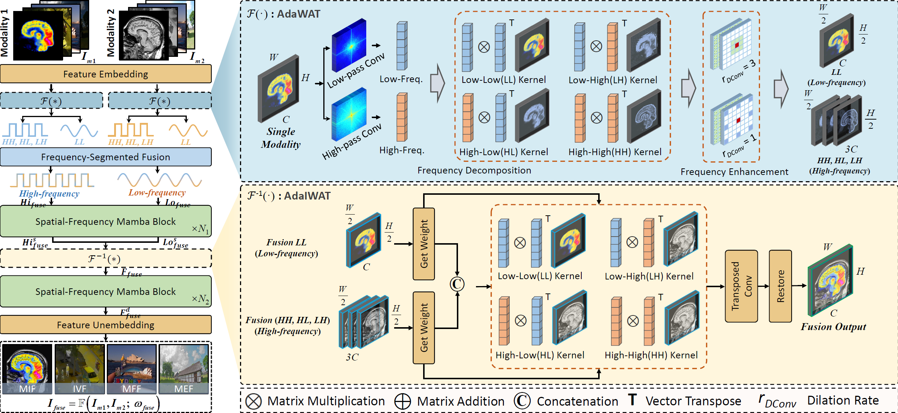
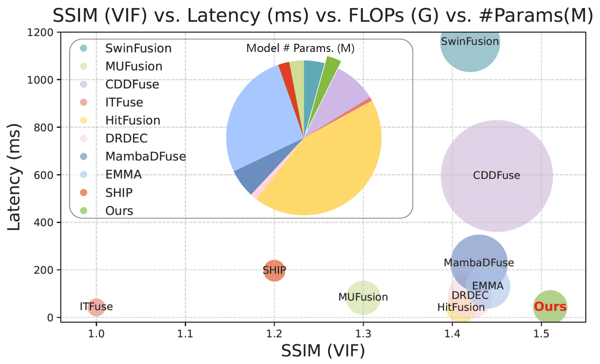
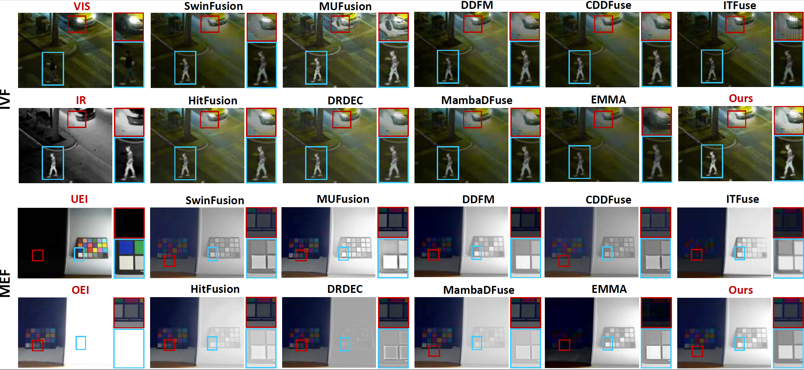
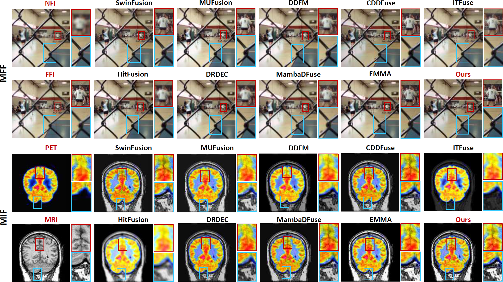
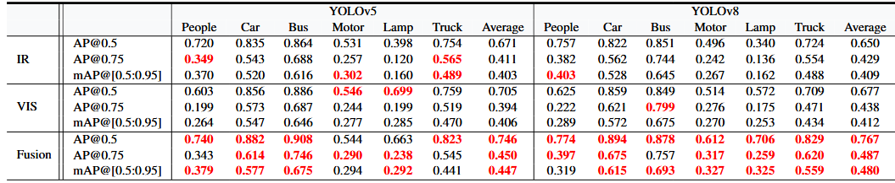

<div align="center">
<h1> Task-Generalized Adaptive Cross-Domain Learning  for Multimodal Image Fusion </h1>

[Mengyu Wang], [Zhenyu Liu], [Yu Wang], [Yuwei Wang], [Yanyan Wei] [Fei Wang]</sup>

[](https://arxiv.org/abs/2508.15505) 

</div>

## Introduction
This is the official implementation of Pytorch, the repository that contains our paper `Task-Generalized Adaptive Cross-Domain Learning  for Multimodal Image Fusion`. [[Paper](https://arxiv.org/abs/2508.15505)]



`AdaSFFuse`, as a lightweight and efficient method, reaches a balance between accuracy and speed. 


## Ecommended Environment
We test our codebase with `PyTorch 1.13.0 + CUDA 11.7` as well as `PyTorch 2.2.1 + CUDA 12.1`. Please install corresponding PyTorch and CUDA versions according to your computational resources. We showcase the environment creating process with PyTorch 1.13.0 as follows.

1. Create environment.
    
    ```shell
    conda create -n AdaSFFuse python=3.8.18
    conda activate AdaSFFuse
    ```

2. Install all dependencies.
Install pytorch, cuda and cudnn, then install other dependencies via:
    
    ```shell
    pip install torch==1.13.0 torchvision==0.14.0 torchaudio==0.13.0 --extra-index-url https://download.pytorch.org/whl/cu117
    pip install causal_conv1d==1.0.0  # causal_conv1d-1.0.0+cu118torch1.13cxx11abiFALSE-cp38-cp38-linux_x86_64.whl
    pip install mamba_ssm==1.0.1  # mamba_ssm-1.0.1+cu118torch1.13cxx11abiFALSE-cp38-cp38-linux_x86_64.whl
    ```

    ```shell
    pip install -r requirements.txt
    ```

## Setup
### Datasets

1. We conducted the study in four directions, each using multiple datasets that are publicly highly cited:
    
    - VIF:[LLVIP](https://github.com/bupt-ai-cz/LLVIP)
    - MEF:[SICE](https://github.com/csjcai/SICE), [MEFB](https://github.com/xingchenzhang/MEFB)
    - MFF:[RealMFF](https://github.com/truth-zheng/RealMFF), [MFI-WHU](https://github.com/HaoZhang1018/MFI-WHU), [Lytro](https://mansournejati.ece.iut.ac.ir/content/lytro-multi-focus-dataset)
    - MIF:[CT-MRI, PET-MRI, SPECT-MRI](https://github.com/xianming-gu/Havard-Medical-Image-Fusion-Datasets)

    Please refer to the original dataset websites for more details. You can download the dataset directly for use.
####################################################################################################################################################################################################################################
2. <u>We also provide the processed datasets we use here: .</u>

3. If you are using your own datasets, please orgnize the dataset folder in the following structure:
    
    ```shell
    <imagefusion>
    |-- <train>
        |-- <IVF>
            |-- <infrared>    
            |-- <visible>  
        |-- <MEF>
            |-- <low>    
            |-- <over>     
        |-- <MFF>
            |-- <imageA>    
            |-- <imageB>   
        |-- <MIF>
            |-- <CT>    
            |-- <MRI>                           
    |-- <test>    
        |-- <VIF>
        |-- ...
    ```

## Usage

### Training
1. Pretrained weights are not available, please use your own weights.<u> To use them, please put them under `options/`. </u>

2. Run multi-GPU distributed training:

    ```shell
    python -m torch.distributed.launch --nproc_per_node=6 --master_port=1234 --use_env train_AdaSFFuse.py
    ```

    You can change the number of GPUs running to match the experimental requirements, and you can modify the ports to avoid conflicts from occurring. If you want to change the training target, change the pretraining weights. See more training options in train_AdaSFFuse.py.

3. Results will be saved in `checkpoint` folder.


### Evaluation
1. Color image fusion results were performed in the following manner, corresponding to each of the four experimental directions::
    
    ```shell
    python test_IVF_RGB.py
    python test_MEF_RGB.py
    python test_MFF_RGB.py
    python test_MIF_RGB.py
    ```
    If changes are made to the location, you can edit the configuration file in it.


2. The assessment indicators are organized in the following manner, corresponding to each of the four experimental directions:

    ```shell
    python test_IVF_norm.py
    python test_MEF_norm.py
    python test_MFF_norm.py
    python test_MIF_norm.py
    ```
    
    It is worth noting that we chose to convert the three-channel image to a Y single-channel image for the metrics test, so the fused image is also single-channel. If you wish to generate a color fused image along with the metrics, you can make changes in the code.

3. Results will be saved in `results` folder.

 ### Visual Comparison



    Qualitative comparison of AdaSFFuse with nine state-of-the-art methods on visible and infrared image fusion. From left to right: original image, and results of SwinFusion, HitFusion, MUFusion, DRDEC, DDFM, MambaDFuse, CDDFuse, EMMA, ITFuse and our AdaSFFuse.

    It is worth noting that we also added a visual comparison of [M3FD](https://github.com/JinyuanLiu-CV/TarDAL) at the end, which is not shown here.

## Downstream Task Evaluation
In order to verify that the fusion effect is more in line with practical application scenarios, we conduct comparison experiments between single-modal images and fused images to compare the performance of object detection and semantic segmentation.

It's worth mentioning that if you don't want to start the configuration all over again, you can use the files we've already configured to evaluate it directly.

### File Download
    The weights required for YOLOv5 and YOLOv8 training can be downloaded from Baidu.com; Segformer is already in the file.

    Yolov5:https://pan.baidu.com/s/1xm2ri63tr7Qr9W7VonRwfA      code:wkp1 
    Yolov8:https://pan.baidu.com/s/1mzZyyR9lGtV4bWwTGDe6SA      code:qv92

    After downloading, put the weights into yolov5\model_data and yolov8\model_data folders.

### Object Detection
    For object detection performance metrics, we use cutting-edge, state-of-the-art (SOTA) computer vision modeling [YOLOv5](https://github.com/ultralytics/yolov5) and [YOLOv8](https://github.com/bubbliiiing/yolov8-pytorch). they delivers the performance and versatility needed to excel in diverse applications.


    In order to fully demonstrate the effectiveness of our method, we chose to perform target detection performance on the [M3FD](https://github.com/JinyuanLiu-CV/TarDAL) dataset for visible (VIS), infrared (IR) and fusion images (our proposed method).

1. Preparation

    You need to fuse the M3FD dataset images using our method, the process remains the same as above.

    ```shell
    python -m torch.distributed.launch --nproc_per_node=6 --master_port=1234 --use_env train_AdaSFFuse.py
    ```

    You need to change the path to the dataset in the weights ".json" file.

    ```shell
    python test_IVF_RGB.py
    ```

2. Preparation of data sets    

    **Use VOC format for training, you need to make your own data set before training**. 

    Place the label file in the VOCdevkit folder in the VOC2007 folder under Annotations before training.   

    Before training, the image files in JPEGImages, JPEGImages_ir and JPEGImages_vis were placed in the VOC2007 folder under the VOCdevkit folder, corresponding to the fusion images, infrared images and visible images.

3. Processing of data sets  

    Once you have finished placing the dataset, you need to create a model_data/cls_classes.txt where you can write the classes you want to differentiate between, which we have already done, or you will need to modify it yourself if you are using a non-M3FD dataset. Run voc_annotation.py to get 2007_train.txt and 2007_val.txt for training.

    ```shell
    python voc_annotation.py
    ```

  
4. Training  

    After modifying the classes_path, you can run train.py to start training, after training multiple epochs, the weights will be generated in the logs folder, note that when training different images, remember to change the folder where the weights and logs are saved. 
    
    **There are more parameters for training, they are all in train.py, you can read the comments carefully, the most important part is still the classes_path in train.py.**   

    ```shell
    python train.py
    ```

5. Anticipate

    Inside the yolo.py file, modify model_path and classes_path to correspond to the trained files; 
    
    **model_path corresponds to the weights file under the logs folder, and classes_path corresponds to the classes in model_path.**   

    ```shell
    python yolo.py
    ```
 
6. Detection

    After dividing the test set using voc_annotation.py, head to the get_map.py file to modify the classes_path.

    ```shell
    python get_map.py
    ```

    It is worth noting that if you want to modify the ratio of the test set, you can modify the trainval_percent under the voc_annotation.py file. trainval_percent is used to specify the ratio of the (training set + validation set) to the test set, by default (training set + validation set):test set = 9:1. train_ percent is used to specify the ratio of training set to validation set in (training set + validation set), by default training set:validation set = 9:1.

    YOLOv8 and YOLOv5 have the same operation and will not be described here, if you want to know more about how to use YOLOv, please go to the official study, I will not elaborate too much here.

### Semantic Segmentation
    For semantic segmentation performance metrics, we used the [SegFormer](https://github.com/ggyyzm/pytorch_segmentation) semantic segmentation model for implementation. The [MFNet](https://github.com/haqishen/MFNet-pytorch) dataset is used for validation.
 
1. Preparation

    You need to fuse the MFNet dataset images using our method, the process remains the same as above.

    ```shell
    python -m torch.distributed.launch --nproc_per_node=6 --master_port=1234 --use_env train_AdaSFFuse.py
    ```

    You need to change the path to the dataset in the weights ".json" file.

    ```shell
    python test_IVF_RGB.py
    ```

2. Preparation of data sets  
    **Use VOC format for training, you need to make your own data set before training**    

    Place the label file in the SegmentationClass in the VOC2007 folder under the VOCdevkit folder before training. 

    Place the image files in JPEGImages, JPEGImages_ir and JPEGImages_vis in the VOC2007 folder under the VOCdevkit folder before training. 


3. Processing of data sets 

    The corresponding txt was generated before training using the voc_annotation.py file.

    ```shell
    python voc_annotation.py
    ```

4. Training
    
    Under the train.py folder, select the backbone model you want to use. It is worth noting to modify the num_classes of train.py to be the number of classifications + 1.     

    ```shell
    python train.py
    ```

5. Anticipate

    Inside the segformer.py file, change model_path, num_classes, and backbone to correspond to the trained files in the following sections;

    **model_path corresponds to the weights file under the logs folder, num_classes represents the number of classes to be predicted plus one, and backbone is the backbone feature extraction network used**

    ```shell
    python segformer.py
    ```
 
6. Detection

    Set num_classes inside get_miou.py as the number of predicted classes plus 1; name_classes as the categories to be de-differentiated; run get_miou.py to get the miou size. 

    ```shell
    python get_miou.py
    ```

## Contact
In this regard, our experiments are all complete, if you have any questions, please contact via email 2408085408337@stu.nchu.edu.cn.

## BibTeX & Citation
If you find this code useful, please consider citing our work:

```bibtex
@article{wang2025task,
  title={Task-Generalized Adaptive Cross-Domain Learning for Multimodal Image Fusion},
  author={Wang, Mengyu and Liu, Zhenyu and Li, Kun and Wang, Yu and Wang, Yuwei and Wei, Yanyan and Wang, Fei},
  journal={arXiv preprint arXiv:2508.15505},
  year={2025}
}
```


